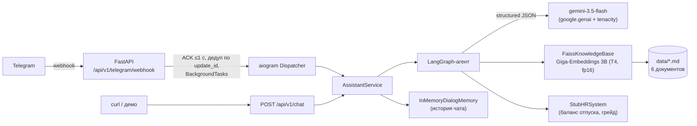
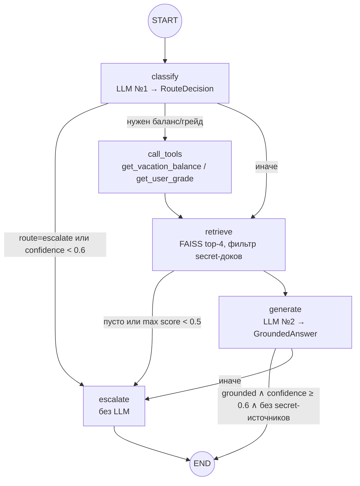
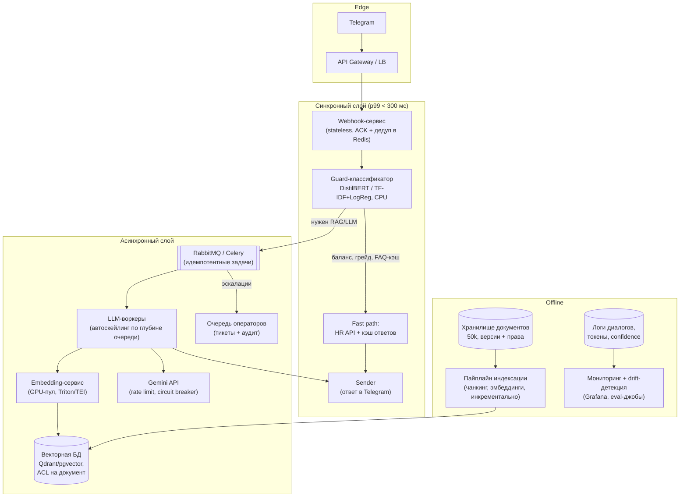

# Внутренний HR/IT-ассистент компании (PoC + System Design)

Telegram-бот первичной поддержки сотрудников: отвечает на вопросы по внутренним
регламентам (RAG по базе знаний), умеет вызывать функции (например, «сколько у меня дней
отпуска»), а критичные и внерегламентные запросы
эскалирует на оператора. Проект в рамках подготовки к заданию AITH «System Design» (2-я часть).

## Что реализовано кодом, а что — дизайном

| | Статус |
|---|---|
| RAG: чанкинг Markdown → эмбеддинги ([ai-sage/Giga-Embeddings-instruct](https://huggingface.co/ai-sage/Giga-Embeddings-instruct), 3B, GPU) → FAISS | ✅ код |
| Агент на LangGraph: классификация → инструменты → retrieval → генерация → эскалация | ✅ код |
| LLM `gemini-3.5-flash` через `google.genai`, только структурный JSON-вывод | ✅ код |
| Инструменты: `get_vacation_balance`, `get_user_grade` (заглушка «внешней» HR-системы) | ✅ код |
| Human-in-the-loop: остановка генерации + `[ESCALATION] ...` в консоль | ✅ код |
| FastAPI: вебхук Telegram (fast-ACK + дедупликация), debug-эндпоинт `/chat`, health/readiness | ✅ код |
| Graceful degradation при недоступности Gemini (выдача сырых фрагментов без LLM) | ✅ код |
| Docker / docker-compose (GPU, кэш модели в volume) | ✅ код |
| Smoke-тесты (pytest, 118 тестов, без сети и без загрузки моделей) | ✅ код |
| Очереди, кэширование ответов, ACL индекса, мониторинг, бейзлайны | 📝 дизайн (ниже) |

## Быстрый старт

```bash
cp .env.example .env      # заполнить GEMINI_API_KEY, TELEGRAM_BOT_API_KEY, HF_TOKEN
docker compose up --build # первый старт скачивает модель эмбеддингов (~14 ГБ) в volume
```

Требуется NVIDIA GPU (nvidia-container-toolkit); без GPU эмбеддер падает на CPU
(fp32) — работает, но медленно. Готовность: `GET /api/v1/health/ready` → 200.

Локально без Docker:

```bash
uv sync
uv run python -m src.main             # API-сервер (вебхук)
uv run python -m src.telegram.polling # либо long polling — без публичного URL
uv run pytest -q                      # тесты (быстрые, офлайн)
RUN_INTEGRATION=1 uv run pytest -m integration -q  # + реальный эмбеддер на GPU
```

Вебхук регистрируется автоматически на старте, если в `.env` заданы
`TELEGRAM_WEBHOOK_URL` (публичный URL, например ngrok) и, желательно,
`TELEGRAM_WEBHOOK_SECRET`. Для демо без Telegram:

```bash
curl -X POST localhost:8000/api/v1/chat -H 'Content-Type: application/json' \
  -d '{"chat_id":"demo","user_id":"100001","text":"За сколько дней нужно предупреждать об отпуске?"}'
```

## Архитектура PoC

Model-Service-Repository: `api/routes → services → repositories`, каждый слой
знает только нижележащий. Вся сборка зависимостей — в `src/dependencies.py`,
ошибки — иерархия `AppError` с единым обработчиком в `create_app()`.



### Граф агента (LangGraph)

Детерминированный plan-and-execute вместо свободного ReAct-цикла: один
структурный вызов LLM решает маршрут и какие инструменты нужны, дальше — жёсткие
узлы. Это дёшево (максимум 2 вызова LLM на сообщение), предсказуемо и полностью
тестируется подменой LLM.



Узел `escalate` не вызывает LLM: отвечает фиксированной фразой «Этот вопрос
требует участия специалиста службы безопасности. Перевожу на оператора...» и
печатает в консоль ровно `[ESCALATION] Запрос передан оператору. Причина: <...>,
История диалога: <...>` (плюс `logger.warning` — задел под аудит).

### Вебхук: почему fast-ACK

Полный конвейер (2 вызова Gemini + эмбеддинг запроса 3B-моделью) занимает
секунды, а Telegram повторяет update, не получивший быстрый 200, — бот начал бы
отвечать на каждый вопрос по несколько раз. Поэтому роут только проверяет секрет
(`X-Telegram-Bot-Api-Secret-Token`), валидирует Update, отбрасывает дубликаты по
`update_id` (ограниченный LRU-набор — идемпотентность ретраев) и планирует
обработку через `BackgroundTasks`, отвечая `{"ok": true}` мгновенно. Ответ
пользователю уходит отдельным вызовом Bot API из фонового обработчика.

### Безопасность в PoC — три эшелона

«Секретные» документы (`salary_and_grades.md`, `employee_directory.md`)
намеренно лежат в индексе — по заданию система должна уметь отказывать:

1. **classify** эскалирует попытки узнать чужую зарплату/ПДн и prompt injection
   (примеры зашиты в системный промпт классификатора);
2. **retrieve** вырезает чанки из `restricted_sources` до того, как их увидит
   генератор, — даже «джейлбрейкнутый» промпт не процитирует то, чего нет в
   контексте; если после фильтра ничего релевантного не осталось — эскалация;
3. **generate** обязан вернуть `is_grounded`/`sources`/`confidence`; ответ со
   ссылкой на секретный источник, неграундед или неуверенный — эскалация.

### Отказоустойчивость в PoC

Вызовы Gemini обёрнуты в tenacity (3 попытки, экспоненциальный backoff — только
на 408/429/5xx и сетевые ошибки). Если провайдер так и не ответил,
`AssistantService` деградирует: выдаёт верхний прошедший фильтры фрагмент
регламента с пометкой «(режим деградации: ответ без LLM)» — поиск по эмбеддингам
работает локально и от Gemini не зависит.

Пороги `min_retrieval_score=0.5` и `min_route_confidence=0.6` откалиброваны на
реальном корпусе: релевантные вопросы дают cosine ≥ 0.58, оффтоп и инъекции —
≤ 0.44.

## Тесты

`uv run pytest -q` — быстрые и офлайн: LLM подменяется скриптованными
`RouteDecision`/`GroundedAnswer`, эмбеддер — детерминированным bag-of-stems,
Telegram — фейковыми bot/dispatcher. Покрыто ровно то, что требует задание:
health-чек отвечает 200; векторная база строится по реальным `data/*.md` и на
вопрос про отпуск возвращает чанк из `leave_policy.md` без участия LLM;
инструменты возвращают `int`; плюс маршрутизация графа по всем пяти
демо-сценариям, точный формат `[ESCALATION]`, дедупликация вебхука, деградация.
Одиночный `integration`-тест (флаг `RUN_INTEGRATION=1`) повторяет проверку
релевантности на настоящем Giga-Embeddings.

---

# System Design: 10 000 сотрудников, 50 000 документов

PoC — один процесс. Ниже — как та же логика раскладывается в продакшен.



## Архитектура под нагрузку

**Разделение быстрого и медленного пути.** Быстрые запросы — проверка баланса,
грейда, топ-FAQ из кэша — это обычный вызов HR-API или Redis-кэша: сотни
миллисекунд, синхронно, без LLM. Медленные — RAG-генерация (секунды). Решение о
маршруте принимает не LLM, а лёгкий guard-классификатор на CPU (см. «Бейзлайны»)
— он же первый эшелон против инъекций.

**Очередь перед LLM.** Вебхук обязан отвечать Telegram мгновенно, поэтому всё,
что дольше сотен миллисекунд, уходит в RabbitMQ (Celery-воркеры). Telegram
получает ACK сразу; воркер отвечает пользователю отдельным вызовом Bot API — в
PoC этот паттерн уже воспроизведён на `BackgroundTasks`. Пики (утро понедельника,
рассылка новой политики) сглаживаются глубиной очереди и автоскейлингом воркеров
по её длине; при перегрузке бот честно пишет «отвечу через пару минут» вместо
таймаута.

**Retries без дублей.** Идемпотентность на двух уровнях: `update_id` от Telegram
дедуплицируется в Redis (в PoC — LRU в памяти), задачи в очереди несут
idempotency-key = `update_id`, воркеры перед отправкой ответа проверяют, не
отвечён ли уже. Ретраи вызовов Gemini — tenacity с экспоненциальным backoff
только на транзиентные коды (уже в PoC).

## Кэширование и отказоустойчивость

- **Кэш ответов**: нормализованный вопрос → ответ (Redis, TTL сутки, инвалидация
  при переиндексации документа-источника). Топ-100 вопросов «как взять отпуск /
  забыл пароль VPN» покрывают заметную долю трафика и не стоят ни одного токена.
- **Кэш эмбеддингов запросов**: повторные и похожие вопросы не гоняют GPU.
- **Gemini упал** (circuit breaker открылся): деградация по ступеням —
  (1) ответ из кэша FAQ; (2) retrieval без суммаризации: топ-фрагменты
  регламента с указанием источника и пометкой о деградации — реализовано в PoC;
  (3) если и поиск недоступен — честное «сервис деградирован» + предложение
  эскалации на человека. Бот никогда не молчит и не выдумывает.
- **Векторная БД** — управляемый кластер (Qdrant/pgvector) с репликами; 50k
  документов ≈ единицы миллионов чанков — это малый объём для современных ANN.

## Безопасность (PII)

- **ACL на уровне индекса, а не промпта.** Каждый чанк несёт метаданные
  (`source`, `access_level`, `owner`); фильтр прав применяется в самом запросе к
  векторной БД по identity сотрудника из Telegram-аккаунта (SSO-маппинг). Зарплатные
  документы джуну не возвращаются вообще — LLM физически не видит того, что
  нельзя показывать. Просить модель «не разглашать» — последний, а не первый
  рубеж (в PoC этот принцип реализован фильтром `restricted_sources` до
  генератора).
- **Prompt injection**: guard-классификатор до LLM (паттерны «забудь инструкции»,
  «покажи файл», смена языка/ролей) + структурный вывод со строгой схемой +
  пост-проверка источников ответа. Текст пользователя никогда не попадает в
  системный промпт.
- **Минимизация PII во внешних API**: в Gemini уходят только вопрос и уже
  отфильтрованные чанки; идентификаторы сотрудника остаются внутри (инструменты
  выполняются на нашей стороне, LLM видит только результат «баланс = 12»).
  С провайдером — контур без обучения на наших данных (data governance).
- **Аудит автоматических решений**: каждый ответ пишется в журнал с полным
  контекстом решения (маршрут, источники, confidence, версия промпта и индекса) —
  это и есть расширение `[ESCALATION]`-лога PoC. Решения с действием (оформить
  отпуск, заказать технику) автоматически не исполняются — только черновик
  заявки с подтверждением человеком (human-in-the-loop по умолчанию для всего,
  что меняет состояние).

## Мониторинг

- **Технические метрики**: латентность по путям (fast/slow), глубина очереди,
  error rate Gemini, доля деградированных ответов, время индексации.
- **Галлюцинации**: доля ответов с `is_grounded=false`, распределение
  `confidence` генератора и классификатора, доля эскалаций по причинам. Ответы с
  низким confidence логируются полностью и попадают в выборку ручной разметки —
  это дешёвый непрерывный источник ground truth. Периодический автоэвал:
  LLM-judge сверяет ответ с процитированными чанками (entailment).
- **Стоимость инференса**: счётчики входных/выходных токенов на каждый вызов
  (usage-метаданные ответа Gemini) → дашборд «₽/диалог», алерты на аномалии
  (инъекция может раздуть контекст), бюджеты по подразделениям.
- **Data drift**: распределение тем вопросов (кластеризация эмбеддингов
  запросов) сравнивается неделя к неделе (PSI/KS-тест); рост кластера без
  близких чанков в базе = «открылся новый офис, а регламента нет» → сигнал
  контент-команде. Отдельно — тренд среднего top-1 score ретривера: падает —
  база устарела относительно вопросов.
- **Отличить деградацию модели от смены потока**: фиксированный golden-set
  вопросов гоняется по расписанию (модель деградировала — упадёт и на нём),
  drift-метрики считаются по входному потоку (сменился поток — golden-set
  стабилен, drift растёт).

## Выбор инструментов и бейзлайны

MVP без нейросетей вообще: маршрутизация — правила и регулярки («отпуск|болничн»
→ статья базы знаний, «баланс» → HR-API, «потерял|фишинг|пароль» → эскалация),
поиск — BM25 по заголовкам, ответ — готовый текст статьи. Такой бот закрыл бы
заметную долю обращений при нулевой стоимости инференса — и это правильный
первый релиз.

Следующая ступень — классический ML: TF-IDF + LogisticRegression (scikit-learn)
как классификатор интентов/критичности. Обучается на исторических тикетах
поддержки, инференс ~миллисекунды на CPU. **Именно здесь LLM избыточна**: в PoC
классификацию делает Gemini (дорого и секунды), в проде первый вызов LLM
заменяется этим классификатором с ориентиром в сотни миллисекунд end-to-end для
fast path; LLM остаётся только там, где нужна генерация связного ответа из
нескольких источников. Эмбеддинги для retrieval — тоже не LLM: локальная
модель (в PoC — Giga-Embeddings) или лёгкая E5-подобная, если GPU-бюджет жмёт.

Порядок запуска бейзлайнов: правила+BM25 → +TF-IDF-классификатор → +векторный
retrieval → +LLM-генерация. Каждая ступень — измеримый прирост против
предыдущей, а предыдущая остаётся режимом деградации следующей.

## Оценка качества без размеченного датасета

1. **Синтетический eval из самой базы**: для каждого чанка LLM генерирует 3–5
   вопросов, на которые он отвечает, → пары (вопрос, эталонный чанк). Метрики
   ретривера: recall@k, MRR (известно, какой чанк «правильный»). Так же
   калибровались пороги PoC.
2. **Адверсариальный набор**: инъекции, вопросы про зарплаты/ПДн, оффтоп —
   метрика = доля корректных отказов/эскалаций (в PoC этот набор живёт в тестах
   графа).
3. **LLM-as-judge для генерации**: судья проверяет faithfulness (каждое
   утверждение подкреплено чанком?) и полноту; периодическая ручная сверка
   выборки судейских вердиктов, чтобы судье можно было верить.
4. **Производственная петля**: 👍/👎 в Telegram + разметка эскалированных
   диалогов операторами (они всё равно их читают) → через месяц есть реальный
   датасет для дообучения классификатора и регрессионный golden-set.

## Ограничения PoC

- Диалоговая память, дедупликация и «HR-система» — в памяти процесса: рестарт
  всё забывает, второй инстанс не поднять (в проде — Redis/Postgres).
- Обработка после ACK живёт в том же процессе (`BackgroundTasks`): упал процесс —
  update потерян; в проде — внешняя очередь с подтверждениями.
- Индекс пересобирается на каждом старте (~30 с на GPU для 6 документов) — для
  50k документов нужен инкрементальный пайплайн и персистентный индекс.
- Классификация каждого сообщения ходит в Gemini — см. «Бейзлайны» про замену
  лёгким классификатором.
- `transformers` закреплён `<5`: remote-код Giga-Embeddings несовместим с 5.x
  (проверено при разработке); flash-attention и bf16 недоступны на T4 — модель
  работает в fp16 + eager attention.
