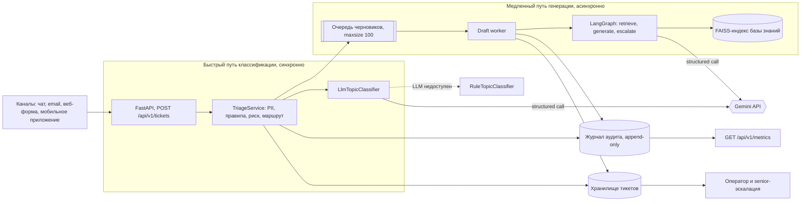
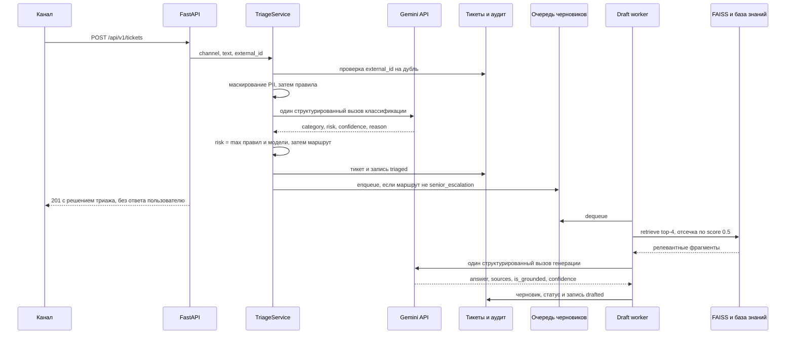

# Целевая архитектура

## Что должно быть:

- основные компоненты; 
- поток данных от входящего тикета до ответа/маршрутизации; 
- синхронные и асинхронные части; 
- хранилища; 
- места вызова сервисов и интеграций; 
- участие человека и запасные пути. 
- Желательно использовать Mermaid для вспомогательных диаграмм.

---

## Обзор

Система принимает обращение, определяет, что это за обращение и насколько оно рискованное, решает, куда его направить, и — если тикет того стоит — готовит оператору черновик ответа по базе знаний. Пользователю ничего не отправляется: `auto_send_allowed` означает «прошёл бы все проверки», а не «ответ ушёл».

Нагрузка из кейса: ~5 млн пользователей, ~200k тикетов в день, то есть в среднем **2.3 rps**, а во время инцидентов 10–20k тикетов за 10 минут — **до 33 rps**. Каналы — чат, email, веб-форма, мобильное приложение.

Архитектура строится вокруг одного разделения: **быстрый путь классификации** решает, куда пойдёт тикет, и работает синхронно; **медленный путь генерации** готовит текст ответа и работает асинхронно. Всё, что нужно для маршрутизации, лежит на первом; всё, что дорого и может подождать, — на втором. Это разделение определяет и деградацию: генерация может быть полностью выключена, а маршрутизация продолжит работать.

Диаграмма читается слева направо и по двум рамкам. Всё, что внутри верхней рамки, выполняется внутри HTTP-запроса и заканчивается ответом клиенту; всё, что внутри нижней, выполняется после ответа. Единственная точка связи между ними — очередь черновиков: триаж кладёт в неё идентификатор тикета и больше ничего о медленном пути не знает. Внешняя интеграция ровно одна — Gemini API, и у неё ровно два места вызова: классификация в быстром пути и генерация в узле `generate`. Метрики не считаются отдельным счётчиком, а проецируются из журнала аудита, поэтому число на дашборде всегда сводится к конкретным записям.

## Основные компоненты

| Компонент | Где в коде | Ответственность |
| --- | --- | --- |
| API-слой | `src/api/routes/tickets.py`, `metrics.py`, `health.py` | 6 эндпоинтов, валидация входа Pydantic v2, без `try`/`except` — ошибки поднимаются как `AppError` |
| `TriageService` | `src/services/triage_service.py` | Быстрый путь: маскирование, правила, классификация, риск, маршрут, запись, аудит, постановка в очередь |
| Маскирование PII | `src/ml/pii.py` | Regex-детектор EMAIL / CARD / PASSPORT / PHONE, возвращает маскированный текст и список найденных типов |
| Детерминированные правила | `src/ml/rules.py` | 8 правил, задающих нижнюю границу риска и категорию; отдельный экран prompt injection |
| Классификатор | `src/ml/classifier.py` | `LlmTopicClassifier` — один структурированный вызов Gemini; `RuleTopicClassifier` — запасной, на правилах |
| Очередь черновиков | `src/repositories/draft_queue.py` | Ограниченная FIFO идентификаторов тикетов, `maxsize=100`, отказ вместо блокировки |
| Draft worker | `src/main.py`, задача в lifespan | Один потребитель очереди; переживает падение на отдельном тикете |
| `DraftService` | `src/services/draft_service.py` | Медленный путь: запуск графа, деградация вместо ошибки, сохранение черновика и статуса |
| Граф черновика | `src/agent/graph.py`, `nodes.py` | LangGraph из трёх узлов: `retrieve`, `generate`, `escalate` |
| База знаний | `src/repositories/knowledge_base.py`, `src/rag/*` | Чанкинг markdown, эмбеддинги Giga-Embeddings, поиск через FAISS `IndexFlatIP` |
| Хранилище тикетов | `src/repositories/ticket_repository.py` | Тикет, решение триажа, черновик, индекс по `external_id` для идемпотентности |
| Журнал аудита | `src/repositories/audit_log.py` | Append-only записи обо всех автоматических решениях |
| `MetricsService` | `src/services/metrics_service.py` | Проекция журнала аудита в операционные метрики |
| `HealthService` | `src/services/health.py` | Liveness без I/O; readiness с разделением критичных и некритичных зависимостей |
| Сборка зависимостей | `src/dependencies.py` | Единственное место связывания компонентов; `lru_cache` для всего, что держит состояние |

Категории фиксированы таксономией из шести меток: `billing/faq`, `billing/payment_issue`, `billing/refund`, `account_recovery`, `technical_issue`, `other`. Уровни риска — `low` / `medium` / `high`, маршруты — `auto_answer` / `operator_queue` / `senior_escalation`.

## Поток данных от входящего тикета до ответа или маршрутизации

Порядок шагов в быстром пути нагружен смыслом, а не случаен.

1. **Дедупликация.** Если передан `external_id`, повторная доставка того же сообщения возвращает уже существующий тикет с кодом 200 вместо 201 и пишет запись `deduplicated`. Повтор не стоит ни одного вызова модели — на инцидентных всплесках это заметная экономия.
2. **Маскирование PII — первым.** Всё, что происходит дальше, видит только маскированный текст: и промпт классификатора, и хранилище, и журнал аудита, и запрос в базу знаний. Исходный текст нигде не сохраняется. Это делает требование «персональные данные не уходят во внешний LLM API» свойством формы пайплайна, а не дисциплины на каждом вызове.
3. **Правила — вторыми, до модели.** Сработавшее правило задаёт нижнюю границу риска, которую модель не имеет права опустить: объединение идёт через `max_risk()` в `src/models/domain.py`. Спор о деньгах, угроза судом или подозрение на взлом опознаются по лексике достаточно надёжно, чтобы не отдавать это решение модели.
4. **Классификация — третьей.** Один структурированный вызов Gemini возвращает категорию, риск, уверенность и короткое обоснование. Обоснование попадает в аудит, чтобы человек, разбирающий автоматическое решение, видел его мотив.
5. **Сборка риска и маршрута.** `risk = max(rule_risk, llm_risk)`; если найдены персональные данные, риск дополнительно поднимается минимум до `medium` — какой бы ни оказалась тема, такой тикет читает человек.
6. **Запись, затем очередь.** Тикет сохраняется до постановки в очередь: воркер ищет тикет по идентификатору, и очередь, раздающая идентификаторы, которых ещё нет в хранилище, теряла бы черновики под конкурентной нагрузкой.

Маршрут выбирается детерминированно, риск голосует первым:

| Условие | Маршрут | Черновик |
| --- | --- | --- |
| `risk = high` или сработал экран prompt injection | `senior_escalation` | не генерируется никогда |
| `risk = medium`, либо `confidence < 0.75`, либо сработал запасной классификатор | `operator_queue` | генерируется, но уходит оператору |
| остальное | `auto_answer` | генерируется |

`auto_send_allowed` выставляется только при одновременном выполнении шести условий: маршрут `auto_answer`, риск `low`, уверенность выше `min_topic_confidence = 0.75`, персональные данные не найдены, экран инъекций не сработал, классифицировала именно модель, а не правила. Любое отклонение снимает флаг.

Медленный путь — граф из трёх узлов. `retrieve` берёт `retrieval_top_k = 4` фрагмента и отбрасывает всё со score ниже `min_retrieval_score = 0.5`; если не осталось ничего, генерация не запускается вовсе и тикет уходит в `escalate`. `generate` делает один структурированный вызов, который возвращает и ответ, и собственный вердикт модели о нём — `is_grounded` и `confidence`. **Отдельного узла верификации нет сознательно**: второй самопроверяющий вызов удвоил бы счёт за суждение, которое модель уже вынесла, поэтому один вызов генерации на тикет — это потолок стоимости, зафиксированный в архитектуре. `route_after_generate` отправляет в `escalate` всё, что не обосновано источниками или имеет `confidence < min_draft_confidence = 0.6`.

Статусы тикета:

| Статус | Что означает |
| --- | --- |
| `triaged` | классифицирован и маршрутизирован; в текущем коде промежуточное значение — наружу тикет выходит уже как `queued` или `awaiting_operator` |
| `queued` | ждёт воркера черновиков |
| `draft_ready` | обоснованный черновик готов и все проверки пройдены; в целевой системе это кандидат на автоотправку |
| `awaiting_operator` | нужен человек; черновик при этом может быть, а может и не быть |

## Синхронные и асинхронные части

**Синхронно** выполняется только то, без чего невозможна маршрутизация: маскирование, правила, один вызов классификации, запись тикета и аудита, постановка в очередь. Ответ 201 содержит решение триажа — категорию, риск, маршрут, найденные типы PII, сработавшие правила и замер латентности, — но не ответ пользователю.

**Асинхронно** выполняется генерация черновика. Клиент за неё не ждёт: он получает решение сразу и опрашивает `GET /api/v1/tickets/{id}` до перехода из `queued` в `draft_ready` или `awaiting_operator`. Плата за такой контракт — необходимость поллинга; в целевой системе на этом месте webhook или push оператору.

Бюджет быстрого пути из кейса — `hot_path_budget_ms = 500`. **PoC его не выдерживает, и это осознанное решение, а не недосмотр**: классификация сделана вызовом LLM, и измеренная латентность триажа составляет p50 2252 мс и p95 2398 мс, то есть 100% тикетов выходят за бюджет. Система не прячет это, а измеряет: `GET /api/v1/metrics` возвращает `triage_latency_ms`, `over_budget` и `over_budget_ratio` относительно того же бюджета. Обоснование выбора и путь к его исправлению — дистилляция классификатора в компактную модель — разобраны в `docs/ml.md`; архитектурно замена стоит в одну строку в `src/dependencies.py`, потому что оба классификатора реализуют один Protocol. Для сравнения: путь на одних правилах, который включается при недоступности провайдера, укладывается в ~0.1–0.4 мс.

Внутри процесса асинхронность реализована честно: единственный CPU-тяжёлый участок — инференс модели эмбеддингов — вынесен в `asyncio.to_thread`, так что event loop не блокируется ни при построении индекса, ни при поисковом запросе.

## Хранилища

| Хранилище | Что хранит | В PoC | Целевое решение |
| --- | --- | --- | --- |
| Тикеты | маскированный текст, решение триажа, черновик, статус, индекс по `external_id` | `InMemoryTicketRepository`: словарь под `asyncio.Lock` | PostgreSQL, уникальный индекс по `external_id` как ключ идемпотентности, партиционирование по дате |
| Журнал аудита | неизменяемые записи о каждом автоматическом решении | `InMemoryAuditLog`: список, только `append` | Append-only таблица в PostgreSQL плюс выгрузка в S3-совместимое объектное хранилище для длительного хранения |
| Индекс базы знаний | 6 чанков из 3 markdown-документов | FAISS `IndexFlatIP` над L2-нормированными векторами, строится при старте и не сохраняется | Персистентный ANN-индекс с конвейером перестроения при изменении базы знаний |
| Очередь черновиков | идентификаторы тикетов | `asyncio.Queue`, `maxsize=100` | RabbitMQ: durable-очередь, publisher confirms, ack на сообщение, DLQ для «ядовитых» тикетов |
| Метрики | собственного хранилища нет | проекция журнала аудита, считается на каждый запрос | Экспорт тех же агрегатов в Prometheus, дашборды в Grafana — см. `docs/monitoring.md` |

Три свойства этой таблицы важнее самих реализаций.

- **Исходного текста обращения нет ни в одном хранилище.** Маскирование выполняется до первой записи, поэтому непромаскированный текст физически негде прочитать — включая ответ API.
- **`IndexFlatIP` над нормированными векторами — это точный косинус.** На корпусе PoC точный индекс просто корректен; ANN нужен только когда корпус перестанет помещаться в память, и это единственная причина его вводить.
- **Аудит и метрики — одно хранилище и два представления.** Отдельного реестра счётчиков нет намеренно: счётчики умеют расходиться с журналом, а проекция — нет.

Ограничение PoC формулируется прямо: всё это живёт в процессе, и рестарт стирает и тикеты, и аудит, и очередь. Индекс при каждом старте собирается заново, а загрузка модели эмбеддингов занимает ~50 секунд — приемлемо для трёх документов и неприемлемо для тысяч.

## Места вызова сервисов и интеграций

Связывание компонентов целиком лежит в `src/dependencies.py`: роуты объявляют `service: TriageServiceDep` и никогда не конструируют зависимости сами, а `lru_cache` держит синглтонами всё, что имеет состояние — хранилища, очередь, индекс, клиент провайдера, скомпилированный граф. Воркер вне цикла запроса собирается тем же кодом через `build_draft_service()`, поэтому у него ровно те же экземпляры хранилищ, что и у API.

**Gemini API — единственная внешняя интеграция, два места вызова.**

- `LlmTopicClassifier.classify()` в быстром пути — схема ответа `TicketClassification`.
- Узел `generate` графа в медленном пути — схема ответа `GroundedDraft`.

Оба вызова идут через один Protocol `SupportsStructuredGeneration` в `src/agent/llm.py`, у которого ровно один режим отказа — `LLMUnavailableError`. Клиент настроен так: `response_schema` принуждает модель к структуре, `temperature = 0`, таймаут `llm_timeout_ms = 10000`, до трёх попыток с экспоненциальной задержкой и джиттером на кодах 408, 429, 500, 502, 503, 504. Невалидируемый ответ приравнивается к недоступности провайдера — половинчатых результатов наверх не приходит.

**Модель эмбеддингов** `ai-sage/Giga-Embeddings-instruct` (3B, fp16 на Tesla T4) загружается в процесс лениво, при первом обращении; lifespan прогревает её заранее при `warmup_on_startup=true`. Модель асимметричная: инструкция добавляется только к запросу, документы индексируются без неё. Вызовы — `embed_documents` при построении индекса и `embed_query` на каждый поиск, оба через `asyncio.to_thread`.

**Каналы.** В PoC канал — это поле `channel` в теле запроса, а вход один: HTTP `POST /api/v1/tickets` с контрактом `TicketCreateRequest` (`extra="forbid"`, текст 1–8000 символов, необязательный `external_id`). Адаптеры чата, почты и веб-формы, приводящие сообщение к этому контракту, — часть целевого дизайна, а не реализации.

**Исходящих интеграций нет вообще.** Ни один компонент не умеет отправить сообщение пользователю, и у модели нет ни одного инструмента с побочным эффектом. Это архитектурная гарантия того, что ошибка модели не может дойти до клиента сама по себе.

## Участие человека и запасные пути

Человек присутствует в системе в трёх ролях: оператор разбирает `operator_queue`, senior — `senior_escalation`, и любой черновик в PoC остаётся предложением, а не ответом. `senior_escalation` не ставится в очередь черновиков вообще: спор о деньгах или юридическая угроза адресуются человеку, поэтому вызов генерации был бы чистой тратой. Побочный эффект приятный — рискованные тикеты стоят ноль вызовов генерации.

Запасные пути покрывают каждый режим отказа, который система вообще может встретить:

| Что сломалось | Поведение | Куда уходит тикет |
| --- | --- | --- |
| Gemini недоступен в быстром пути | `LLMUnavailableError` перехватывается, работает `RuleTopicClassifier`; его уверенность ограничена 0.6 и 0.2, то есть заведомо ниже порога 0.75 | всегда `operator_queue`, запись `llm_classification_failed` |
| Gemini недоступен в медленном пути | `DraftService` строит деградированный черновик; retrieval пробуется отдельно, потому что недоступность провайдера не означает недоступности индекса | `awaiting_operator` с фрагментами базы знаний вместо ответа |
| Индекс не загружен или пуст | `retrieve` не находит ничего выше порога — узел `generate` не запускается | `escalate`, затем `awaiting_operator` |
| Черновик не обоснован источниками или `confidence < 0.6` | `route_after_generate` отправляет в `escalate` с причиной | `awaiting_operator`, причина в аудите |
| Очередь черновиков заполнена | `submit()` возвращает `False`, тикет не теряется | `awaiting_operator`, запись `queue_rejected` |
| `GEMINI_API_KEY` не задан | подставляется `NullLLMClient`, и весь сервис работает в режиме «LLM выключен навсегда» — это тот же код, что и при реальном сбое | всё уходит людям |
| Воркер упал на конкретном тикете | цикл ловит исключение и продолжает: один плохой тикет не убивает потребителя | остальная очередь обрабатывается |
| Прогрев базы знаний не удался | приложение всё равно стартует; отказ стартовать означал бы менять деградацию на полное отсутствие сервиса | триаж работает, черновики деградируют |

Readiness устроен под ту же логику: критичны только `tickets` и `audit`, а `llm` и `knowledge_base` показываются в ответе, но не переводят инстанс в 503. Иначе сбой провайдера выводил бы из балансировщика инстансы, которые прекрасно умеют классифицировать и маршрутизировать. Отказы этих путей и их последствия разобраны в `docs/risks-and-ops.md`.

Каждое автоматическое решение оставляет след: `deduplicated`, `triaged`, `llm_classification_failed`, `queue_rejected`, `queued`, `drafted`. Полный след по тикету доступен через `GET /api/v1/tickets/{id}/audit`.

## Что реализовано, а что архитектурный дизайн

| Реализовано в коде | Заявлено как целевой дизайн |
| --- | --- |
| FastAPI-приложение и 6 эндпоинтов | Адаптеры каналов: чат, email, веб-форма, мобильное приложение |
| Маскирование PII, правила, экран prompt injection | Детектор PII на основе NER поверх regex-слоя |
| Классификация одним структурированным вызовом Gemini и запасной классификатор на правилах | Дистиллированная компактная модель классификации ради бюджета 500 мс, см. `docs/ml.md` |
| Расчёт риска и маршрута, флаг `auto_send_allowed` | Фактическая автоотправка ответов пользователю — в PoC отсутствует принципиально |
| Граф LangGraph из трёх узлов, retrieval через FAISS и Giga-Embeddings | Персистентный ANN-индекс и конвейер перестроения базы знаний |
| Хранилище тикетов и журнал аудита в памяти | PostgreSQL для тикетов, append-only таблица и объектное хранилище для аудита |
| Ограниченная `asyncio.Queue` и один воркер в lifespan | RabbitMQ: durable-очередь, publisher confirms, ack на сообщение, DLQ; несколько потребителей |
| Метрики как проекция аудита в JSON | Экспорт в Prometheus и дашборды Grafana, см. `docs/monitoring.md` |
| Liveness и readiness с разделением критичных зависимостей | Горизонтальное масштабирование и оркестрация нескольких инстансов |
| Демо-скрипт с happy path и рискованным путём, pytest-набор, docker compose | Интерфейс оператора — вне рамок кейса |

Правая колонка — предложения, а не принятые решения: ни один из этих компонентов не внедрён, не настроен и не подразумевается выбранным. Там, где они упоминаются в остальных документах отчёта, используются те же названия.