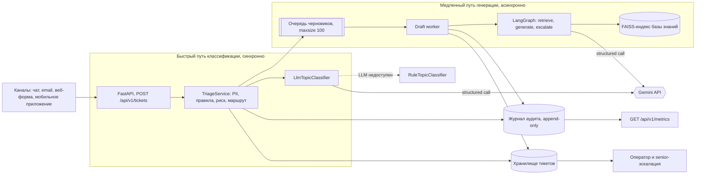
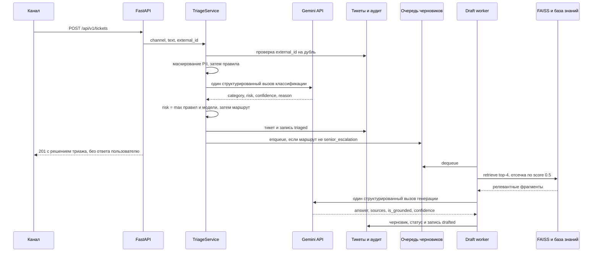

# Целевая архитектура

## Обзор

Система принимает обращение, определяет, что это за обращение и насколько оно рискованное, решает, куда его направить, и — если тикет того стоит — готовит оператору черновик ответа по базе знаний.

Архитектура строится вокруг одного разделения: **быстрый путь классификации** решает, куда пойдёт тикет, и работает синхронно; **медленный путь генерации** готовит текст ответа и работает асинхронно. Всё, что нужно для маршрутизации, лежит на первом; всё, что дорого и может подождать, — на втором. Это разделение определяет и деградацию: генерация может быть полностью выключена, а маршрутизация продолжит работать.

Всё, что внутри верхней рамки, выполняется внутри HTTP-запроса и заканчивается ответом клиенту; всё, что внутри нижней, выполняется после ответа. Единственная точка связи между ними — очередь черновиков: триаж кладёт в неё идентификатор тикета и больше ничего о медленном пути не знает.

## Основные компоненты

| Компонент | Где в коде | Ответственность |
| --- | --- | --- |
| API-слой | `src/api/routes/tickets.py`, `metrics.py`, `health.py` | 6 эндпоинтов |
| `TriageService` | `src/services/triage_service.py` | Быстрый путь |
| Маскирование PII | `src/ml/pii.py` | Regex-детектор |
| Детерминированные правила | `src/ml/rules.py` | 8 правил |
| Классификатор | `src/ml/classifier.py` | Вызов Gemini и запасной, на правилах |
| Очередь черновиков | `src/repositories/draft_queue.py` | Ограниченная FIFO идентификаторов тикетов |
| Draft worker | `src/main.py`, задача в lifespan | Один потребитель очереди |
| `DraftService` | `src/services/draft_service.py` | Медленный путь |
| Граф черновика | `src/agent/graph.py`, `nodes.py` | LangGraph |
| База знаний | `src/repositories/knowledge_base.py`, `src/rag/*` | Чанкинг, эмбеддинги, RAG |
| Хранилище тикетов | `src/repositories/ticket_repository.py` | Хранилище тикетов |
| Журнал аудита | `src/repositories/audit_log.py` | Append-only записи обо всех решениях |
| `MetricsService` | `src/services/metrics_service.py` | Проекция журнала аудита в операционные метрики |
| `HealthService` | `src/services/health.py` | Проверка |
| Сборка зависимостей | `src/dependencies.py` | Место связывания компонентов |

Категории фиксированы из меток: `billing/faq`, `billing/payment_issue`, `billing/refund`, `account_recovery`, `technical_issue`, `other`. Уровни риска — `low` / `medium` / `high`, маршруты — `auto_answer` / `operator_queue` / `senior_escalation`.

## Поток данных от входящего тикета до ответа или маршрутизации

Маршрут выбирается детерминированно, риск голосует первым:

| Условие | Маршрут | Черновик |
| --- | --- | --- |
| `risk = high` или сработал экран prompt injection | `senior_escalation` | не генерируется никогда |
| `risk = medium`, либо `confidence < 0.75`, либо сработал запасной классификатор | `operator_queue` | генерируется, но уходит оператору |
| остальное | `auto_answer` | генерируется |

`auto_send_allowed` выставляется только при одновременном выполнении шести условий: маршрут `auto_answer`, риск `low`, уверенность выше `min_topic_confidence = 0.75`, персональные данные не найдены, экран инъекций не сработал, классифицировала именно модель, а не правила. Любое отклонение снимает флаг.

Медленный путь — граф из трёх узлов. `retrieve` берёт `retrieval_top_k = 4` фрагмента и отбрасывает всё со score ниже `min_retrieval_score = 0.5`; если не осталось ничего, генерация не запускается вовсе и тикет уходит в `escalate`. `generate` делает один структурированный вызов, который возвращает и ответ, и собственный вердикт модели о нём — `is_grounded` и `confidence`. **Отдельного узла верификации нет сознательно**: второй самопроверяющий вызов удвоил бы счёт за суждение, которое модель уже вынесла, поэтому один вызов генерации на тикет — это потолок стоимости, зафиксированный в архитектуре. `route_after_generate` отправляет в `escalate` всё, что не обосновано источниками или имеет `confidence < min_draft_confidence = 0.6`.

Статусы тикета:

| Статус | Что означает |
| --- | --- |
| `triaged` | классифицирован и маршрутизирован; в текущем коде промежуточное значение — наружу тикет выходит уже как `queued` или `awaiting_operator` |
| `queued` | ждёт воркера черновиков |
| `draft_ready` | обоснованный черновик готов и все проверки пройдены; в целевой системе это кандидат на автоотправку |
| `awaiting_operator` | нужен человек; черновик при этом может быть, а может и не быть |

## Синхронные и асинхронные части

**Синхронно** выполняется только то, без чего невозможна маршрутизация: маскирование, правила, один вызов классификации, запись тикета и аудита, постановка в очередь.

**Асинхронно** выполняется генерация черновика.

Внутри процесса асинхронность реализована честно: единственный CPU-тяжёлый участок — инференс модели эмбеддингов — вынесен в `asyncio.to_thread`, так что event loop не блокируется ни при построении индекса, ни при поисковом запросе.

## Хранилища

| Хранилище | Что хранит | В PoC | Целевое решение |
| --- | --- | --- | --- |
| Тикеты | маскированный текст, решение триажа, черновик, статус, индекс по `external_id` | `InMemoryTicketRepository`: словарь под `asyncio.Lock` | PostgreSQL |
| Журнал аудита | неизменяемые записи о каждом автоматическом решении | `InMemoryAuditLog`: список, только `append` | Append-only таблица в PostgreSQL плюс выгрузка в S3-совместимое объектное хранилище для длительного хранения |
| Индекс базы знаний | 6 чанков из 3 markdown-документов | FAISS `IndexFlatIP` над L2-нормированными векторами, строится при старте и не сохраняется | - |
| Очередь черновиков | идентификаторы тикетов | `asyncio.Queue`, `maxsize=100` | RabbitMQ |
| Метрики | собственного хранилища нет | проекция журнала аудита, считается на каждый запрос | Экспорт в Prometheus, дашборды в Grafana — см. `docs/monitoring.md` |

## Интеграций

**Gemini API — единственная внешняя интеграция, два места вызова.**

- `LlmTopicClassifier.classify()` в быстром пути — схема ответа `TicketClassification`.
- Узел `generate` графа в медленном пути — схема ответа `GroundedDraft`.

**Модель эмбеддингов** `ai-sage/Giga-Embeddings-instruct` (3B, fp16 на Tesla T4) загружается в процесс лениво, при первом обращении; lifespan прогревает её заранее при `warmup_on_startup=true`. Модель асимметричная: инструкция добавляется только к запросу, документы индексируются без неё. Вызовы — `embed_documents` при построении индекса и `embed_query` на каждый поиск, оба через `asyncio.to_thread`.

**Исходящих интеграций нет вообще.** Ни один компонент не умеет отправить сообщение пользователю, и у модели нет ни одного инструмента с побочным эффектом. Это архитектурная гарантия того, что ошибка модели не может дойти до клиента сама по себе.

## Участие человека и запасные пути

Человек присутствует в системе в трёх ролях: оператор разбирает `operator_queue`, senior — `senior_escalation`, и любой черновик в PoC остаётся предложением, а не ответом.

## Что реализовано, а что архитектурный дизайн

| Реализовано в коде | Заявлено как целевой дизайн |
| --- | --- |
| FastAPI-приложение и 6 эндпоинтов | Адаптеры каналов |
| Маскирование PII, правила, экран prompt injection | Детектор PII на основе NER поверх regex-слоя |
| Классификация одним структурированным вызовом Gemini и запасной классификатор на правилах | Дистиллированная компактная модель классификации ради бюджета 500 мс, см. `docs/ml.md` |
| Расчёт риска и маршрута, флаг `auto_send_allowed` | Фактическая автоотправка ответов пользователю — в PoC отсутствует принципиально |
| Хранилище тикетов и журнал аудита в памяти | PostgreSQL|
| Ограниченная `asyncio.Queue` и один воркер в lifespan | RabbitMQ |
| Метрики как проекция аудита в JSON | Экспорт в Prometheus и дашборды Grafana, см. `docs/monitoring.md` |
| Демо-скрипт с happy path и рискованным путём, pytest-набор, docker compose | Интерфейс оператора — вне рамок кейса |

Правая колонка — предложения, а не принятые решения: ни один из этих компонентов не внедрён, не настроен и не подразумевается выбранным. Там, где они упоминаются в остальных документах отчёта, используются те же названия.