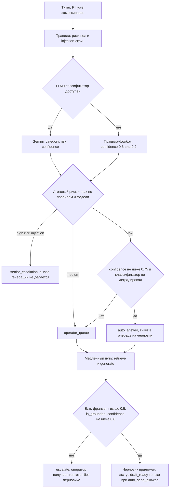

# Какие ML/LLM-задачи есть в системе и почему выбран такой подход

## Что должно быть:

- что решается правилами; 
- где уместна классическая ML-модель; 
- где нужны embeddings/retrieval; 
- где нужен LLM; 
- где LLM использовать не стоит; 
- какие baseline разумно запустить первыми; 
- как валидировать качество; 
- как обрабатывать низкую уверенность. 
- В случае использования моделей машинного обучения необходимо подсветить, откуда они берутся — открытые модели, обученные внутри, какие данные нужны и какие технические метрики для выбора используются. 
- Отдельно, при необходимости, подсветить процесс разметки исторических данных.

---

## Карта задач

| Задача | Как решено сегодня | Почему так | Целевое решение |
| --- | --- | --- | --- |
| Маскирование PII | 4 якорных regex: `EMAIL`, `CARD`, `PASSPORT`, `PHONE` | нужна гарантия и воспроизводимость, а не суждение модели | тот же механизм, расширенный словарь типов |
| Риск-пол и prompt-injection | 8 keyword-правил и 5 injection-паттернов | детерминизм, 0.1 мс, читаемое обоснование в аудите | те же правила плюс регулярный ручной ревью словаря |
| Категория и уровень риска | один structured-вызов `gemini-3.5-flash` | размеченных продуктовых данных ещё нет | дистиллированная модель на логах, LLM — только как учитель |
| Поиск фрагментов базы знаний | `Giga-Embeddings-instruct` + FAISS `IndexFlatIP` | лексического пересечения между обращением и регламентом не хватает | те же эмбеддинги, ANN-индекс вместо точного |
| Черновик ответа | один structured-вызов Gemini поверх найденных фрагментов | открытая генерация на русском — то, где LLM незаменим | то же |
| Проверка обоснованности черновика | `is_grounded` и `confidence` в том же вызове | потолок стоимости — один вызов генерации на тикет | то же, финальная проверка — оператор |

Полный поток и границы синхронной и асинхронной частей описаны в `architecture.md`; здесь — только про то, какая задача решается каким классом методов и почему.

## Что решается правилами

Правила закрывают две вещи, где нужна гарантия, а не оценка: персональные данные и риск-пол. Обе выполняются до того, как текст доходит до модели.

**Маскирование PII** (`src/ml/pii.py`) идёт первым шагом триажа. Дальше по конвейеру — в хранилище, в промпт классификатора, в retrieval, в аудит — попадает только замаскированный текст, поэтому требование «персональные данные не уходят во внешний LLM API» выполняется формой конвейера, а не дисциплиной на каждом вызове. Regex здесь правильный инструмент именно потому, что он аудируем и покрывается тестами: для маскирования нужна проверяемая гарантия на каждом конкретном случае, а модель такой гарантии дать не может — она даёт статистику. Паттерны сознательно якорные и в обратную сторону тоже: номер заказа не является персональными данными, и маскировать его — значит уничтожить идентификатор, ради которого оператор открывает тикет. Поэтому у телефона обязателен префикс `+7`/`8`, у карты — lookaround, а у паспорта — контекстные слова «серия/номер/паспорт».

**Риск-пол** (`src/ml/rules.py`) — таблица из 8 правил. Сработавшее правило поднимает минимальный уровень риска, который модель не имеет права опустить: комбинирование идёт через `max_risk`, риск только повышается.

| Правило | Что ловит | Риск-пол | Категория |
| --- | --- | --- | --- |
| `legal_threat` | суд, полиция, прокуратура, Роспотребнадзор, ЦБ | high | — |
| `refund_demand` | «верните деньги», chargeback, двойное списание | high | `billing/refund` |
| `account_takeover` | взлом, мошенник, фишинг, «заходил не я» | high | `account_recovery` |
| `abuse` | оскорбления в адрес компании | high | — |
| `account_recovery` | восстановление доступа, забыл пароль | medium | `account_recovery` |
| `payment_issue` | оплатил, но доступ не выдан; платёж висит | low | `billing/payment_issue` |
| `technical_issue` | 500/502, «сайт не работает», недоступен | low | `technical_issue` |
| `billing_faq` | «как привязать/сменить карту», способы оплаты | low | `billing/faq` |

**Prompt-injection screen** — 5 паттернов инструкций внутри тела тикета. Отмеченный тикет получает риск `high`, уходит в `senior_escalation` и никогда не передаётся генератору, то есть атака вообще не доходит до провайдера. Это первая линия защиты; вторая — формулировка в системном промпте, что текст обращения является данными, а не инструкциями (`src/agent/prompts.py`).

**PII как риск-пол.** Если в теле нашлись персональные данные, риск поднимается минимум до `medium` независимо от темы, а `auto_send_allowed` становится невозможным. Личные данные в обращении означают, что его читает человек.

Измерение на golden set (`uv run python scripts/evaluate.py`) объясняет, почему правила — это пол и фолбэк, а не классификатор: **precision 1.000 по каждой реальной категории при recall 0.2–0.6**, macro-F1 **0.598**, accuracy 0.567, 0.1 мс на тикет. Когда правило срабатывает, оно право; но срабатывает оно редко, и тикет проваливается в `other`. Такая асимметрия идеальна для роли «поднять риск и подстраховать при отказе LLM» и непригодна для роли «решить, что это за тикет».

## Где уместна классическая ML-модель — и почему её здесь ещё нет

Это центральное решение документа, и это осознанный выбор, а не пропуск.

Классификация в закрытую таксономию из 6 меток по короткому русскому тексту при потоке 200k тикетов в день и бюджете 500 мс — учебниковая задача для классической модели. TF-IDF + LogisticRegression решает её за единицы миллисекунд на CPU, без внешней зависимости и без счётчика на вызовы. Сегодня же на быстром пути стоит вызов LLM, и именно поэтому PoC **не укладывается в целевые 500 мс**: замеры на живом сервисе дают p50 **2252 мс**, p95 **2398 мс**, `over_budget_ratio` = 1.0, то есть 100% тикетов за бюджетом. Отдельный замер самого классификатора на golden set — **2325 мс** на тикет в среднем. Фолбэк-путь на правилах в живом сервисе укладывается в **0.1–0.4 мс**, то есть быстрый путь как таковой существует и работает, узкое место ровно одно и оно названо.

Почему модель не построена сейчас: **нет размеченных продуктовых данных**. Golden set — 30 рукописных тикетов, `data/tickets/historical_tickets.json` — небольшой демонстрационный файл; ни то, ни другое не обучающая выборка. Построить TF-IDF + LogReg сегодня означало бы угадать распределение меток до появления реального трафика, зафиксировать это угадывание в весах и потом объяснять, почему модель уверенно ошибается на категориях, которых в её выборке почти не было. Порядок обратный: **сначала собрать логи, потом разметить, потом дистиллировать**. LLM в этой схеме работает учителем, пока обслуживает трафик.

Лестница классификаторов:

| Ступень | Что это | Роль | Статус |
| --- | --- | --- | --- |
| 0 | `RuleTopicClassifier` | риск-пол и фолбэк при недоступности LLM | измерена: macro-F1 0.598, 0.1 мс |
| 1 | `LlmTopicClassifier`, `gemini-3.5-flash` | боевой классификатор и учитель для разметки | работает сегодня: macro-F1 1.000, 2325 мс |
| 2 | TF-IDF + LogisticRegression на логах | первый дистиллят, снимает вызов LLM с быстрого пути | ждёт данных |
| 3 | Дообученный энкодер BERT-класса либо линейная голова поверх Giga-Embeddings | если ступень 2 не добирает по macro-F1 | ждёт данных |

Шов для замены уже проложен: `TopicClassifier` в `src/ml/classifier.py` — это `Protocol`, а `get_topic_classifier()` в `src/dependencies.py` — единственное место, где выбирается реализация. Переход на дистиллят стоит одного нового класса и одной изменённой строки, без правок в сервисах, роутах и графе.

Правило приёмки жёсткое: **дистиллированная модель обязана обойти LLM на golden set прежде, чем ей разрешат быть быстрее него**. Скорость — не аргумент, если она куплена ценой пропущенного `billing/refund`.

Чем пожертвовали: сегодняшним соблюдением 500 мс. Обмен сознательный — правильная таксономия и покрытие всех шести категорий сейчас важнее латентности, потому что латентность лечится дистилляцией по известному рецепту, а неверная таксономия отравляет весь последующий датасет.

## Где нужны embeddings и retrieval

Retrieval нужен ровно в одном месте — на медленном пути, чтобы черновик опирался на регламент, а не на память модели. Ключевой поиск здесь не работает: пользователь пишет «не могу оплатить картой мир», а в базе знаний раздел называется «способы оплаты и привязка карты» — лексического пересечения почти нет, а семантическое очевидно.

- **Модель**: `ai-sage/Giga-Embeddings-instruct` — открытые веса с Hugging Face, 3B, запускается локально, fp16 на Tesla T4, `attn_implementation="eager"` (на T4 нет flash-attention и bf16). Модель асимметричная и instruction-tuned: инструкция подставляется **только к запросу**, документы индексируются как есть (`src/rag/embedder.py`).
- **Чанкинг**: разбиение по структуре заголовков `#`/`##`/`###` с сохранением заголовка внутри текста чанка, и только переросшие секции доламываются рекурсивным сплиттером на 800 символов с перекрытием 100 (`src/rag/chunker.py`). Заголовок остаётся в тексте, потому что он несёт половину смысла для эмбеддинга. Текущий индекс: **6 чанков из 3 документов**.
- **Индекс**: FAISS `IndexFlatIP` поверх L2-нормализованных векторов, то есть точная косинусная близость. На корпусе такого размера точный поиск просто корректен, а ANN добавил бы приближение без выигрыша. Целевой вариант — IVF/HNSW, когда корпус перестанет помещаться в память.
- **Пороги**: `retrieval_top_k=4`, `min_retrieval_score=0.5`. Порог важнее ранжирования: нерелевантный фрагмент, вернувшийся первым, — это ровно то, из-за чего генератор уверенно галлюцинирует. Если после отсечки не осталось ничего, вызов генерации **не делается вовсе**, тикет уходит оператору.

Чем пожертвовали: индекс не персистится и перестраивается на каждом старте, а загрузка модели стоит **~50 с**. Для трёх документов приемлемо, для пятидесяти тысяч — нет; целевой вариант описан в `architecture.md`.

Второе применение тех же эмбеддингов — как признаков: замороженные векторы плюс линейная голова дают ступень 3 лестницы без дообучения энкодера, а поиск ближайших соседей по историческим тикетам даёт дешёвое распространение меток при разметке.

## Где нужен LLM

Два места, и в обоих аргумент один — задача открытая и разметки под неё нет.

1. **Классификация на холодном старте.** Категория, риск и уверенность возвращаются одним structured-вызовом с `response_schema=TicketClassification`, `temperature=0.0`, ответ валидируется Pydantic. Модель даёт приличное качество без единого размеченного примера, что и делает её правильным *первым* шагом, а не постоянным решением. Определения категорий живут в системном промпте и одновременно служат инструкцией для разметчиков.
2. **Генерация черновика по найденным фрагментам.** Здесь LLM незаменим: нужно связно ответить по-русски, опираясь только на переданный регламент, и честно сказать, когда его не хватает. Контракт — `GroundedDraft`: `answer`, `sources`, `is_grounded`, `confidence`.

`is_grounded` и `confidence` запрашиваются **в том же вызове**, что и ответ. Чем пожертвовали: независимый верификатор поймал бы случай, когда модель ошибается в оценке собственной обоснованности, — но он удваивает счёт за суждение, которое модель уже вынесла. Выбран потолок «один вызов генерации на тикет», а реальной проверкой остаётся оператор: ничто из сгенерированного не уходит пользователю.

## Где LLM использовать не стоит

- **Как постоянный классификатор на быстром пути.** 2325 мс на тикет и оплата за вызов при 200k тикетов в день — это ~200k тарифицируемых вызовов ежедневно только на классификацию, плюс внешняя зависимость на критическом пути. Ровно это место и подлежит дистилляции.
- **Для детерминированных решений о риске и PII.** Нужна гарантия, а не суждение: «паспорт всегда замаскирован» — это утверждение, которое должно проверяться тестом, а не измеряться на выборке. Поэтому риск, который поставили правила, модель не может понизить, а маскирование до модели вообще не доходит.
- **Как собственный верификатор** — вторая проверка тем же семейством моделей коррелирует с первой и стоит вдвое; дешевле и надёжнее человек на рискованных категориях.
- **Как единственная защита от prompt injection.** Инструкция «текст — это данные» помогает, но не является барьером; барьер — regex-скрин до вызова и запрет на генерацию для отмеченных тикетов.
- **Там, где вызов заведомо не окупается.** Тикеты в `senior_escalation` не получают вызова генерации вообще: спор о деньгах или угроза жалобой разбирается человеком, и черновик здесь — чистая трата.

## Baseline, которые разумно запустить первыми

Порядок — от того, что уже измерено, к тому, что требует данных.

1. **Правила (сделано).** macro-F1 0.598, 0.1 мс. Это нижняя планка: любая модель, не превосходящая её, не нужна.
2. **LLM zero-shot (сделано).** macro-F1 1.000 на golden set. Это верхняя планка на сегодня и учитель для разметки.
3. **TF-IDF + LogisticRegression.** Слова 1–2-граммы плюс символьные 3–5-граммы (русская морфология без лемматизации), `class_weight="balanced"` из-за перекоса потока в сторону `billing/*`. Первое, что запускается, как только появится несколько тысяч размеченных тикетов.
4. **Линейная голова поверх замороженных Giga-Embeddings.** Ничего не обучается, кроме логистической регрессии на векторах; модель уже загружена ради retrieval.
5. **Дообученный энкодер BERT-класса** (`rubert-tiny2` как дешёвый вариант, ruBERT-base — если качества не хватит). Обе влезают в fp16 на T4; `rubert-tiny2` при этом остаётся в единицах миллисекунд на CPU, что и делает его удобной целью для быстрого пути.
6. **Retrieval-бейзлайны**: BM25 против текущего плотного индекса, и подбор `retrieval_top_k` и `min_retrieval_score` по recall@4.
7. **Бейзлайн для черновика**: «выдать оператору только найденные фрагменты, без генерации». Он уже реализован как деградированный путь (`DEGRADED_WITH_CONTEXT`), поэтому с ним можно честно сравнивать: если правки оператора к сгенерированному черновику занимают не меньше времени, чем ответ по фрагментам, генерация не окупается.

## Как валидировать качество

**Офлайн.** `scripts/evaluate.py` прогоняет классификатор по `data/tickets/golden_set.json` и печатает precision/recall/F1 по каждому классу, macro-F1 и матрицу ошибок. Запускается без сети (`--llm` добавляет прогон Gemini).

**Честная оговорка про golden set.** Это 30 рукописных, чистых и хорошо разделимых обращений, по 5 на категорию. Это smoke-тест, а не оценка точности: `1.000` у LLM означает «не ошибся на лёгких случаях», а не «точность 100%». Реальные цифры дадут только залогированные продуктовые обращения — с опечатками, смешанными темами, письмами на три экрана и пересланными цепочками. Задача golden set сейчас другая и вполне конкретная: ловить регрессии при смене промпта или модели и служить линейкой, которую обязан превзойти дистиллят.

**Что пока не валидируется.** В golden set у каждого тикета есть поле `risk`, но `scripts/evaluate.py` считает метрики только по категории. Уровень риска и итоговый маршрут офлайн не оцениваются — это известный пробел; закрывается добавлением второго отчёта по `risk` и по `route` в тот же скрипт.

**Онлайн.** Три источника сигнала:

- **Аудит-трейл.** Каждое автоматическое решение пишет запись; `GET /api/v1/tickets/{id}/audit` отдаёт цепочку по тикету. Выборочный ручной разбор случайной подвыборки — базовый способ увидеть то, чего не видно в агрегатах.
- **Правки операторов как поток меток.** Оператор всё равно читает черновик и всё равно ставит финальную категорию; зафиксировать «принял / поправил / переназначил» стоит дёшево и даёт непрерывный размеченный поток. Это главный долгосрочный источник данных для дистилляции.
- **Расхождение правил и модели.** Тикеты, где сработало правило с категорией, а LLM выдал другую, — самая информативная выборка и для ревью, и для активного обучения.

Какие из этих величин наблюдаются в эксплуатации и с какими порогами — в `monitoring.md`; здесь они не дублируются.

## Как обрабатывать низкую уверенность

Принцип один: **неопределённость всегда разрешается в пользу человека**, и ни один деградированный путь не может закончиться автоответом.

Диаграмма показывает, что у неуверенности три независимых выхода к человеку — по риску, по уверенности классификатора и по обоснованности черновика, — и ни один из них нельзя обойти, повысив уверенность на одном из шагов.

Конкретные механизмы:

- **Порог темы `min_topic_confidence=0.75`.** Ниже — `operator_queue`, какой бы ни была категория. Промпт классификатора прямо инструктирует ставить значение ниже 0.75 при расплывчатой формулировке и объясняет, что такой тикет уйдёт человеку и это правильный исход.
- **Фолбэк не может закрыть тикет.** `RuleTopicClassifier` возвращает confidence 0.6 при совпадении правила и 0.2 без совпадения — обе величины **ниже** порога 0.75 по построению. Плюс сам факт деградации отдельно учитывается в маршрутизации. Ошибка LLM физически не может превратиться в автоответ.
- **`auto_send_allowed` — конъюнкция всех гарантий сразу**: маршрут `auto_answer`, риск `low`, уверенность выше порога, PII не найдены, injection не найден, классификатор именно `llm`. Любое одно нарушение снимает флаг.
- **Медленный путь эскалирует по трём причинам**: не осталось фрагментов выше `min_retrieval_score=0.5` (тогда вызов генерации вообще не делается), `is_grounded=false`, либо `confidence < min_draft_confidence=0.6`.
- **Переполнение очереди** (`draft_queue_maxsize=100`) — тоже низкая уверенность в возможности обслужить: черновик не делается, тикет уходит оператору, в аудит пишется `queue_rejected`. Меньше черновиков, ни одного потерянного тикета.

Значения 0.75, 0.6 и 0.5 — инженерные значения по умолчанию, выбранные консервативно, а **не откалиброванные измерения**. Калибровка возможна только на логах: по накопленной выборке строится precision на срезе «разрешено к автоответу» в зависимости от порога, и порог выбирается как минимальный, при котором precision на этом срезе держится выше целевого. До появления такой выборки пороги остаются намеренно завышенными — цена ошибки в сторону человека ниже.

## Происхождение моделей, данные и метрики выбора

### Откуда берутся модели

| Компонент | Происхождение | Где исполняется | Статус |
| --- | --- | --- | --- |
| `gemini-3.5-flash` | внешний API, закрытые веса, через `google-genai` | у провайдера | используется для классификации и генерации |
| `ai-sage/Giga-Embeddings-instruct` | открытые веса, Hugging Face | локально, T4, fp16 | используется для retrieval |
| Правила и PII | модели нет, детерминированный код | локально | используется |
| scikit-learn | только офлайн-оценка | локально | артефакта модели в репозитории нет |

**Внутри ничего не обучено.** Это осознанное положение дел на стадии PoC: обучать не на чем. Первая обученная внутри модель — дистиллят классификатора; всё остальное остаётся внешним или открытым.

### Какие данные нужны дистилляту

Одна строка обучающей выборки: замаскированный текст обращения, канал (`chat`/`email`/`web_form`/`mobile`), финальная категория после проверки оператором, финальный риск, финальный маршрут, флаг «оператор изменил решение системы», исход черновика (принят / отредактирован / отброшен), метка времени. Всё это, кроме операторских полей, уже пишется в аудит-трейл; операторские поля требуют интеграции с инструментом оператора — см. `architecture.md`.

Объём: ориентировочно **500–1000 примеров на класс**, то есть ~3–5k размеченных тикетов для ступени TF-IDF + LogReg на шести категориях, и **20–50k**, чтобы дообучение энкодера начало окупаться относительно линейной модели. Это инженерная оценка по типовым задачам текстовой классификации, а **не измерение на этих данных**. При потоке 200k тикетов в день даже 1%-ная выборка даёт 2k размеченных обращений в день, поэтому речь идёт о неделях сбора, а не о месяцах. Отдельное требование к выборке: редкие и рискованные категории (`billing/refund`, `account_recovery`) добираются целевым сэмплированием, иначе естественный перекос потока оставит их недопредставленными именно там, где ошибка дороже всего.

### Технические метрики выбора

- **macro-F1** — основная метрика выбора: классы несбалансированы, а `other` не должен вытягивать общую точность за счёт остальных.
- **F1 по каждому классу** отдельно — модель с хорошим macro-F1 и провалом на одном классе неприемлема.
- **Recall на `billing/refund` и `account_recovery`** — с наибольшим весом. Пропущенный высокорисковый тикет стоит дороже лишней эскалации: ложная эскалация тратит время оператора, пропуск — деньги, SLA и репутацию. Это жёсткий гейт: кандидат, ухудшивший recall на этих категориях, отклоняется даже при выросшем macro-F1.
- **Precision на срезе, допущенном к автоответу** (в основном `billing/faq`) — здесь ошибка уходит наружу, поэтому именно precision, а не F1.
- **p95 латентности** против бюджета 500 мс на быстром пути.
- **Стоимость на 1000 тикетов** — сравнивается между ступенями лестницы; методика подсчёта и мониторинг — в `monitoring.md`.
- Для эмбеддингов: **recall@4** на парах «обращение — правильный фрагмент» и доля обращений, у которых лучший фрагмент проходит порог 0.5.

## Разметка исторических данных

Разметка организуется в три контура, чтобы не платить за ручную работу там, где метка приходит сама.

1. **Слабые метки бесплатно.** Решение системы плюс действие оператора дают метку без отдельного процесса: подтверждённая оператором категория — положительный пример, изменённая — исправленный. Отдельно ценны правки черновика: принятый без изменений черновик подтверждает и категорию, и retrieval.
2. **Ручная двойная разметка на рискованных срезах.** `billing/refund`, `account_recovery`, а также всё, что отмечено PII или injection, размечаются двумя аннотаторами независимо; расхождение уходит на разбор старшему специалисту. Согласованность отслеживается через Cohen's kappa — низкая kappa означает не плохих разметчиков, а плохую инструкцию.
3. **Golden set держится отдельно.** Он никогда не попадает в обучающую выборку и пополняется из продуктового трафика вручную — прежде всего теми случаями, где система ошиблась. Иначе метрика приёмки перестаёт быть независимой.

Организационные детали, которые важны:

- **Инструмент — Label Studio** (предложение, в PoC не развёрнут): self-hosted, импортирует JSON и экспортирует в той же форме, что `data/tickets/golden_set.json`, что позволяет прогнать выгрузку через существующий `scripts/evaluate.py` без переходников.
- **Разметчики видят только замаскированный текст.** Сырое тело не хранится, поэтому в разметку физически нечего утечь.
- **Инструкция для разметчиков — это системный промпт классификатора.** Определения шести категорий и трёх уровней риска живут в `src/agent/prompts.py` в одном экземпляре. Расхождение аннотаторов означает, что промпт неоднозначен: правится и промпт, и инструкция одновременно, иначе модель и разметка начнут расходиться в определениях.
- **Приоритет отбора на ручную разметку**: тикеты с `confidence` ниже 0.75, тикеты с расхождением правил и модели, тикеты, которые оператор переназначил в другую очередь. Это дешёвый вариант активного обучения: ручной труд тратится там, где модель не уверена, а не на потоке очевидных `billing/faq`.
