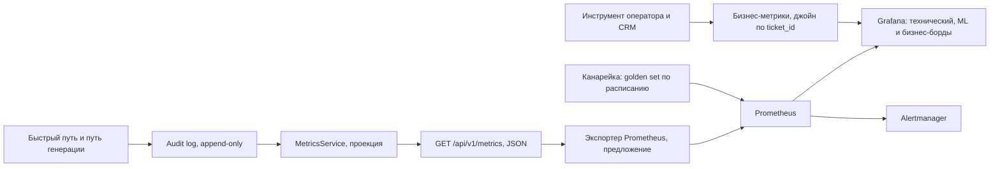

# Как система наблюдается в эксплуатации

## Что должно быть:

- технические и ML-метрики; 
- как отслеживаются продуктовые/бизнес-метрики (просто назовите, какие бизнес-метрики меряете); 
- стартовые алерты; 
- как отличить деградацию модели от изменения входящего потока; 
- мониторинг стоимости LLM; 
- как отслеживается, что реальная исходная задача решается.

---

## Что уже отдаёт PoC

Наблюдаемость построена на одном принципе: **счётчиков нет, есть проекция аудит-лога**. Каждое автоматическое решение пишет ровно одну запись в append-only журнал, а `MetricsService` пересчитывает агрегаты из этих же записей на каждый запрос. Поэтому любое число на дашборде трассируется до конкретных тикетов, и метрика не может разойтись с журналом решений — расходиться нечему.

`GET /api/v1/metrics` возвращает:

| Группа | Поля |
| --- | --- |
| Объём и распределения | `tickets_total`, `by_category`, `by_risk`, `by_route` |
| Решения | `auto_send_allowed`, `low_confidence`, `pii_detected`, `injection_flagged` |
| Классификатор | `llm_classifications`, `rule_fallbacks` |
| LLM | `llm_calls`, `llm_failures` |
| Черновики | `drafts_ready`, `drafts_degraded` |
| Очередь | `queue_rejected` |
| Латентность | `triage_latency_ms {count, p50_ms, p95_ms, max_ms}`, `hot_path_budget_ms`, `over_budget`, `over_budget_ratio` |

Это JSON, а не формат экспозиции Prometheus: в целевом развёртывании те же агрегаты экспортируются как gauge и histogram в Prometheus, сверху Grafana, алерты — в Alertmanager. Логика проекции — это то, что имело смысл показать в PoC; экспортер — механическая обвязка.

Схема показывает две вещи, которые важнее самих панелей: единственным источником истины остаётся аудит-лог, а бизнес-метрики приходят сбоку — из инструмента оператора, потому что внутри сервиса их измерить нечем.

## Технические метрики

| Метрика | Источник сегодня | Зачем |
| --- | --- | --- |
| RPS по эндпоинтам и каналам | HTTP-слой, предложение | базовая нагрузка ~2.3 rps при 200k тикетов в день, всплеск инцидента — до ~33 rps |
| p50 / p95 / max латентности триажа | `triage_latency_ms` | это и есть быстрый путь; сейчас p50 **2252 мс**, p95 **2398 мс** |
| `over_budget`, `over_budget_ratio` | проекция против `hot_path_budget_ms=500` | доля тикетов вне бюджета; сегодня 1.0, и это сознательно измеряется, а не прячется |
| Error rate по кодам и по `code` из `ErrorResponse` | HTTP-слой, предложение | машиночитаемый код ошибки уже есть в теле ответа |
| Глубина очереди черновиков | `DraftQueue.pending()` пишется в детали событий `queued` и `queue_rejected` | заполнение при `draft_queue_maxsize=100` — ранний признак всплеска |
| `queue_rejected` | проекция | backpressure сработал: черновиков меньше, тикеты не потеряны |
| Сбои и рестарты воркера черновиков | логи, предложение | остановившийся воркер выглядит как растущая очередь без роста `drafts_ready` |
| Латентность, таймауты и ретраи вызовов LLM | клиент Gemini: `llm_timeout_ms=10000`, до 3 попыток | ретрай стоит как полный вызов и растягивает хвост латентности |
| Готовность зависимостей | `GET /api/v1/health/ready` | индекс базы знаний загружен, аудит доступен |

Пробелы, которые честно называются: глубина очереди сегодня извлекается из деталей аудит-записей, а не отдаётся отдельным полем `MetricsResponse`; отдельной разбивки латентности по стадиям (маскирование, правила, вызов LLM) нет, замеряется полный триаж. Обе величины — очевидные кандидаты в экспортер и требуют правок в коде, поэтому здесь зафиксированы как предложение.

## ML-метрики

| Метрика | Источник | Что означает |
| --- | --- | --- |
| Распределение `category_confidence` | детали записей `triaged`; сегодня в проекции есть только счётчик | гистограмма уверенности — главный ранний индикатор; сдвиг влево виден раньше падения качества |
| Доля `low_confidence` | `low_confidence / tickets_total` при пороге `min_topic_confidence=0.75` | сколько тикетов ушло человеку из-за неопределённости |
| Доля `rule_fallbacks` | `rule_fallbacks / tickets_total` | прямой сигнал деградации провайдера: каждый такой тикет по построению уходит оператору |
| `drafts_degraded` против `drafts_ready` | проекция | генерация не отработала и оператор получил только фрагменты |
| Доля обоснованных черновиков | `is_grounded` в записях `drafted` | падение означает, что база знаний отстала от вопросов пользователей |
| Доля эскалаций с медленного пути | `escalated` в записях `drafted` | сколько черновиков не прошли гейты 0.5 / `is_grounded` / 0.6 |
| Распределение retrieval-score | требует добавления max score в запись `drafted` — предложение | сползание к порогу 0.5 предупреждает о разрыве между потоком и базой знаний до того, как посыплется обоснованность |
| `by_category`, `by_risk`, `by_route` | проекция | распределение решений; оно же — половина диагностики сдвига потока |
| `pii_detected`, `injection_flagged` | проекция | нагрузка на защитные контуры; описание самих контуров — в `risks-and-ops.md` |

Метрики качества классификатора (macro-F1, per-class F1, recall на `billing/refund` и `account_recovery`), заявленные в `ml.md` как метрики выбора модели, в эксплуатации наблюдаются двумя способами: канарейкой на golden set (см. ниже) и офлайн-переоценкой на размеченной подвыборке продуктового трафика.

## Продуктовые и бизнес-метрики

Внутри сервиса они не измеряются: в PoC пользователю ничего не отправляется, а исход тикета известен только инструменту оператора. Собираются джойном по `ticket_id` между аудит-логом и CRM.

- Доля автоматизации — в PoC её прокси `auto_send_allowed / tickets_total`, то есть «сколько тикетов были бы допущены к автоответу».
- Доля правок и переназначений оператором (override rate).
- Среднее время обработки тикета оператором.
- Доля переоткрытых тикетов (reopen rate).
- CSAT по обращениям, прошедшим через систему.
- Соблюдение SLA по времени первого ответа, отдельно в инциденте и вне его.
- Стоимость обработки одного тикета: LLM плюс операторские минуты.
- Доля тикетов, ушедших в `senior_escalation`.

## Стартовые алерты

Пороги ниже — стартовые значения, а не откалиброванные: их полагается пересчитать после первой недели наблюдений по фактическому базовому уровню.

| Алерт | Условие | Почему именно так |
| --- | --- | --- |
| Провайдер деградировал | доля `rule_fallbacks` > 5% за 5 минут | правила-фолбэк по построению держат confidence ниже 0.75, поэтому каждый такой тикет падает на оператора; нагрузка на поддержку вырастет в течение минут. Page |
| Отказы LLM | `llm_failures` > 1% от `llm_calls` за 10 минут | ретраи исчерпаны: квота, ключ, недоступная модель. Отличается от предыдущего тем, что ловит и сбои генерации, а не только классификации |
| Регресс латентности | `over_budget_ratio` > 0.05 за 15 минут | взводится **после** переноса классификации на дистиллят: сегодня значение равно 1.0 по конструкции, и алерт на него был бы шумом. До этого момента вместо него — алерт на рост p95 более чем на 50% к недельному базовому уровню |
| Backpressure очереди | `queue_rejected` > 0 за 5 минут | очередь при `draft_queue_maxsize=100` заполнена: всплеск инцидента или зависший воркер. Warning, не page — тикеты не теряются, теряются только черновики |
| Падение обоснованности | доля `is_grounded` среди `drafted` ниже недельного базового уровня на 10 п.п. за час | база знаний отстала от потока либо сменились промпт или модель; корень определяется по следующему разделу |
| Сервис не готов | `GET /api/v1/health/ready` отдаёт 503 дольше 1 минуты | индекс не загружен или аудит недоступен — медленный путь не обслуживается |
| Нарушение инварианта безопасности | `auto_send_allowed` совпал с `risk != low` или с непустым `pii_types` | этого не может произойти по построению `TriageService`; если произошло — сломана логика гейтов, а не модель. Page |

## Как отличить деградацию модели от изменения входящего потока

Обе беды выглядят одинаково на дашборде: падает уверенность, растёт `low_confidence`, растут эскалации. Различить их можно только измеряя вход и выход **независимо друг от друга**.

**Метод — фиксированная канарейка.** Golden set (30 тикетов, `data/tickets/golden_set.json`) прогоняется по расписанию через боевой классификатор, macro-F1 и средняя латентность пишутся как временной ряд. Вход у этого прогона неизменен по определению, поэтому любое движение метрики относится к модели, промпту или провайдеру и ни к чему больше. Стоит это 30 вызовов в час — пренебрежимо на фоне 200k тикетов в день.

Параллельно ведутся **статистики входа**, не зависящие от решений модели: распределение длины текста, микс каналов, доля срабатываний правил, доля `pii_detected`, доля новых n-грамм относительно недельного словаря, а также `by_category` и `by_risk` как производные, но полезные.

| Канарейка на golden set | Статистики входа | Вывод |
| --- | --- | --- |
| падает | стабильны | Модель, промпт или провайдер. Смотреть версию промпта и id модели |
| стабильна | изменились: растёт `other`, падает уверенность, новые n-граммы | Изменился входящий поток: новый инцидент, новая фича, новая формулировка рассылки |
| падает | изменились | Оба фактора; разбирать по каналам и по категориям отдельно, начиная с канарейки — она однозначна |
| стабильна | стабильны, но растут override rate и reopen | Проблема ниже по стеку: retrieval, устаревшая база знаний или процесс оператора, а не классификатор |

**Версионирование как условие диагноза.** Чтобы первая строка таблицы вообще давала ответ, вместе с решением нужно хранить идентификатор модели и версию промпта. Сегодня в `TriageDecision` пишется только `classifier` (`llm` или `rules`); добавление `model_id` и хеша промпта в детали аудит-записи — предложение, требующее правки кода. Без этого самая вероятная причина необъяснимого падения канарейки — молчаливая смена модели провайдером за алиасом — остаётся недоказуемой. Закрепление точного идентификатора модели и алерт на его изменение — самая дешёвая страховка из всех в этом документе.

## Мониторинг стоимости LLM

**Что считается.** `llm_calls` в проекции складывается из двух разных по цене вещей, и разделять их обязательно: `llm_classifications` — вызовы классификатора на быстром пути, короткий промпт и короткий ответ; вызовы генерации — считаются как число записей `drafted` за вычетом `drafts_degraded`, и у них в промпте лежат до 4 фрагментов базы знаний, то есть на порядок больше токенов. Смешивать их в одну цифру бессмысленно: дистилляция классификатора убирает целиком первую половину и почти не трогает вторую.

**Чего не хватает.** Токены сейчас не фиксируются. Предложение: писать `usage_metadata` ответа Gemini (входные и выходные токены) в детали аудит-записи — тогда стоимость на тикет считается той же проекцией, что и всё остальное, без отдельной системы учёта.

**Метрики**: токены на вызов по типам, стоимость на тикет, стоимость на 1000 тикетов, доля ретраев (ретрай оплачивается как полный вызов), доля тикетов, дошедших до генерации.

**Структурные ограничители, уже заложенные в код** — они дешевле любого мониторинга, потому что не дают счёту вырасти, а не сообщают о росте постфактум:

- Тикеты в `senior_escalation` никогда не запускают генерацию: у высокорисковых обращений ответ пишет человек, вызов был бы чистой тратой.
- Тикеты с отметкой prompt injection не передаются провайдеру вообще.
- Если после порога `min_retrieval_score=0.5` не осталось ни одного фрагмента, вызов генерации не делается — эскалация происходит до расхода.
- `is_grounded` и `confidence` запрашиваются в том же вызове, что и ответ: потолок — один вызов генерации на тикет, отдельная верификационная модель удвоила бы счёт.
- Ограниченная очередь на 100 элементов ставит потолок скорости генерации: во время инцидента счёт не может вырасти пропорционально всплеску.
- Таймаут 10 с и не более 3 попыток ограничивают стоимость одного зависшего вызова.

**Алертить нужно на стоимость одного тикета, а не только на суммарные траты.** Суммарные траты падают во время аварии — вызовов просто меньше, — тогда как удлинившийся промпт, размножившиеся ретраи или выросший топ-K поднимают цену каждого тикета при том же общем счёте. Порядок величин, за которым надо следить: 200k тикетов в день — это ~200k вызовов классификации плюс генерация для доли тикетов, не ушедших в `senior_escalation`, то есть потолок меньше 400k вызовов в сутки.

## Как отслеживается, что реальная задача решается

Исходная задача из кейса — снизить нагрузку на операторов, ускорить типовые обращения и точнее маршрутизировать сложные, не потеряв безопасность. Ни одна метрика по отдельности этого не показывает.

- **Доля автоматизации и override rate — только вместе.** Высокая автоматизация при высоком проценте правок означает, что система быстрая и неправильная; это худший исход из возможных, потому что он выглядит как успех на графике загрузки операторов. Целевая динамика — автоматизация растёт, доля правок не растёт.
- **Точность маршрутизации** — доля тикетов, которые оператор переложил в другую очередь. Это прямое измерение фразы «точнее маршрутизировать сложные случаи», и оно же лучший поток меток для дистилляции (см. `ml.md`).
- **Reopen rate** — пользователь вернулся с тем же вопросом. Ловит случаи, когда черновик формально обоснован, но по сути не помог.
- **Соблюдение SLA по первому ответу**, отдельно в инциденте и вне его. Всплеск 10–20k тикетов за 10 минут — это ровно тот режим, ради которого строилось разделение быстрого и медленного пути, поэтому мерить SLA усреднённо по месяцу бессмысленно.
- **Время обработки оператором** — падает ли оно на тикетах, к которым приложен черновик, по сравнению с тикетами без него. Это прямая проверка того, что генерация вообще окупается.
- **Безопасность как контр-метрика.** `auto_send_allowed` не должен встречаться вместе с `risk != low`, непустым `pii_types` или `injection_flagged` — ни разу. В PoC это гарантировано конъюнкцией в `TriageService`, поэтому метрика служит регрессионным тестом на уровне эксплуатации: ненулевое значение означает сломанную логику гейтов.
- **Ручная выборка аудита.** Еженедельно старший специалист разбирает случайную выборку цепочек `GET /api/v1/tickets/{id}/audit` и оценивает три вещи: верна ли категория, верен ли маршрут, годится ли черновик. Дашборд не покажет систематически неправильную, но уверенную классификацию — выборочный разбор покажет.

Важная оговорка: в PoC пользователю не отправляется ничего, поэтому `auto_send_allowed` читается как «тикет был бы допущен к автоответу», а не «ответ ушёл». Все метрики автоматизации до включения реальной отправки измеряют потенциал, а не факт.
